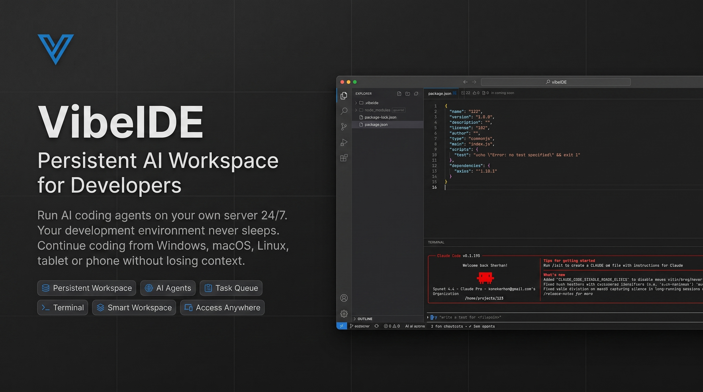

# VibeIDE

VibeIDE is a persistent browser IDE for remote vibe-coding workspaces. It is designed to run on a VDS 24/7: open it from a laptop, phone, or tablet, manage projects, edit files, use Git, keep terminal sessions alive while the backend is running, and send tasks to CLI-based AI agents.

The app combines a Vue/Monaco frontend with a Fastify backend, project-scoped filesystem APIs, WebSocket terminals, Git tools, and a lightweight file-backed AI agent task queue. No database, Redis, or PostgreSQL is required.

## Features

- Browser IDE with Monaco Editor, file explorer, workspace notes, tabs, Git panel, terminal panel, and mobile/PWA support.
- Project manager where every folder inside `workspace` is treated as a separate project.
- Lazy workspace loading so large folders like `node_modules`, `.venv`, `target`, and `build` do not freeze the UI.
- `.vibeignore` plus default ignored folders, with `Open Anyway` for manual inspection.
- WebSocket terminals scoped to the current project.
- Git status/diff scoped only to the project root, with optional `Initialize repository`.
- CLI AI agents through `node-pty`: Claude Code, Codex, Gemini, or a custom command from `config/settings.json`.
- Persistent file-backed task queue and logs under `.vibeide/agents`.
- Telegram notifications for agent task events.
- Compact Project Runtime Dashboard and Workspace Health widgets.
- Login protection, safe path checks, file size limits, binary-file protection, and workspace-only execution.

## One-Command Install

Linux/macOS:

```bash
curl -fsSL https://raw.githubusercontent.com/kantaevsherhan/vibe-ide/main/scripts/install.sh | bash
```

Windows PowerShell:

```powershell
irm https://raw.githubusercontent.com/kantaevsherhan/vibe-ide/main/scripts/install.ps1 | iex
```

Custom Linux/macOS install:

```bash
curl -fsSL https://raw.githubusercontent.com/kantaevsherhan/vibe-ide/main/scripts/install.sh \
  | env VIBEIDE_INSTALL_DIR=/opt/vibe-ide VIBEIDE_PORT=9090 VIBEIDE_WORKSPACE_DIR=/home/projects bash
```

Custom Windows install:

```powershell
irm https://raw.githubusercontent.com/kantaevsherhan/vibe-ide/main/scripts/install.ps1 | iex
# or after downloading:
.\scripts\install.ps1 -InstallDir C:\vibe-ide -Port 9090 -WorkspaceDir C:\projects
```

The installer clones or updates the repository, installs dependencies, builds frontend and backend, writes config files, starts VibeIDE in the background, and prints the URL.

Default values:

```txt
Install dir: ~/vibe-ide on Linux/macOS, %USERPROFILE%\vibe-ide on Windows
URL: http://127.0.0.1:8080
Workspace: <install-dir>/workspace
Login: admin / change-me
```

Stop background process:

```bash
~/vibe-ide/scripts/stop.sh
```

```powershell
& "$env:USERPROFILE\vibe-ide\scripts\stop.ps1"
```

## Build and Start

For manual production startup:

```bash
npm install
npm run build
npm start
```

Open:

```txt
http://127.0.0.1:8080
```

Do not open `apps/frontend/dist/index.html` directly as a file. The built frontend must be served by the backend so API routes, auth cookies, and WebSocket terminals work.

## Manual Update

After logging in, open the Projects page and click `Check for Updates` to pull the latest changes from GitHub and rebuild VibeIDE.

The backend runs a fixed update flow from the VibeIDE project root:

```txt
git fetch origin
git status -uno
git pull origin main
npm install
npm run build
```

If VibeIDE is already current, the UI shows `Already up to date`. If updates were installed, restart the server so the running backend process uses the rebuilt files.

## Docker

```bash
docker build -t vibe-ide .
docker run -p 8080:8080 -v ./workspace:/workspace vibe-ide
```

For an absolute host workspace:

```bash
docker run -p 8080:8080 -v /home/projects:/workspace vibe-ide
```

## Security

VibeIDE is protected by credentials from:

```txt
config/vibeide.config.json
```

Change these values before exposing the app:

```json
{
  "auth": {
    "username": "admin",
    "password": "change-me",
    "sessionSecret": "change-this-secret"
  }
}
```

Do not keep `change-me` in production. Anyone with that password can read and edit workspace files and open a terminal inside the workspace. Also replace `sessionSecret` with a long random value so session cookies cannot be guessed.

Change host, port, and workspace in the same file:

```json
{
  "server": {
    "host": "0.0.0.0",
    "port": 8080
  },
  "workspace": {
    "path": "/workspace",
    "maxFolderChildren": 500
  }
}
```

Feature flags and file limits:

```json
{
  "security": {
    "allowTerminal": true,
    "allowGit": true,
    "maxFileSizeMb": 5,
    "allowedOrigins": ["https://ide.example.com"]
  }
}
```

For production behind Nginx, terminate HTTPS at Nginx and proxy to VibeIDE on localhost. Use a concrete domain in `allowedOrigins`; `["*"]` is intended only for development.

## Projects

VibeIDE treats every folder inside `workspace` as a separate project:

```txt
workspace/
├── my-react-app/
├── backend-api/
└── landing-page/
```

After login, VibeIDE opens `/projects`. From there you can create, open, and delete projects. Project metadata is stored at:

```txt
workspace/<project>/.vibeide/project.json
```

Inside the IDE, file operations, Git commands, terminals, and AI agents are scoped to that project folder only.

VibeIDE also creates a project-local `.vibeide/.gitignore`:

```txt
agents/
sessions/
logs/
tasks.json
state.json
```

This keeps AI logs, task queues, temporary sessions, and runtime state out of Git while allowing project documentation to be committed.

## File Explorer

VibeIDE does not scan the whole project at once. It loads only one folder level at a time:

```txt
GET /api/files/children?projectName=my-project&path=src
```

Ignored folders remain visible but muted. Defaults include:

```txt
node_modules, dist, build, target, .next, .nuxt, .venv, vendor, .git
```

Project-specific ignore rules live in:

```txt
workspace/<project>/.vibeignore
```

Use `Open Anyway` to inspect an ignored folder one level at a time:

```txt
GET /api/files/children?projectName=my-project&path=node_modules&force=true
```

Large folders are capped by `workspace.maxFolderChildren`. Large files and binary files are protected from accidental Monaco preview.

## Workspace Notes

Workspace Notes is a small Obsidian-like Markdown tree inside each project. Notes are stored next to the project metadata:

```txt
workspace/<project>/.vibeide/notes/
```

The Notes activity view behaves like the file explorer: folders are loaded lazily, can be expanded and collapsed, and support creating Markdown files, folders, rename, delete, duplicate, copy path, and drag-and-drop moves.

Opening a note uses the same editor tab system as source files. Markdown notes autosave after edits and support `Edit`, `Preview`, and `Split` modes with rendered tables, task lists, code blocks, links, images, blockquotes, horizontal rules, emoji, and syntax highlighting.

Notes live inside `.vibeide` because they belong to VibeIDE's project workspace, but they are intentionally not ignored. Markdown files under `.vibeide/notes` should be indexed by Git so architecture notes, TODOs, prompts, and project documentation travel with the repository. Only runtime files listed in `.vibeide/.gitignore` are excluded.

## Git

Git commands run only inside the selected project. VibeIDE does not read parent repositories. If `.git` is not present directly in the project root, the Git panel shows that the project is not a Git repository and offers `Initialize repository`.

Git API:

```txt
GET  /api/git/status?projectName=
POST /api/git/init
GET  /api/git/diff?projectName=&path=
```

## Terminals

Terminals run through WebSocket and `node-pty` with `cwd` set to:

```txt
workspace/<project>
```

Active terminals and their buffered output are kept in backend memory while the backend process is running. After backend restart, active terminals are reset.

## Settings

VibeIDE has two settings layers.

Local settings are stored in browser `localStorage` and are unique for each device:

- Theme: `Dark` or `Light`.
- Editor font size.
- Editor font family.

Server settings are stored in:

```txt
config/settings.json
```

They are shared for every device that opens the same VibeIDE server:

- AI agent command, arguments, and enabled state.
- Custom agents.
- Telegram notification settings.
- Workspace information and future workspace options.

Open `Settings` from the Projects page or from the IDE activity bar. Changes are saved automatically.

Settings API:

```txt
GET  /api/settings
PUT  /api/settings
POST /api/settings/test-telegram
```

## AI Agents

VibeIDE runs CLI-based AI agents inside the current project. Agents are configured in:

```txt
config/settings.json
```

Example:

```json
{
  "agents": [
    { "id": "claude", "name": "Claude Code", "command": "claude", "args": ["-p", "{prompt}"], "inputMode": "argument", "enabled": true },
    { "id": "codex", "name": "Codex", "command": "codex", "args": ["exec", "--sandbox", "workspace-write", "{prompt}"], "inputMode": "argument", "enabled": true },
    { "id": "gemini", "name": "Gemini", "command": "gemini", "args": ["-p", "{prompt}"], "inputMode": "argument", "enabled": true },
    { "id": "custom", "name": "Custom Agent", "command": "npx", "args": ["my-agent"], "inputMode": "stdin", "enabled": false }
  ],
  "notifications": {
    "telegram": {
      "enabled": false,
      "botToken": "",
      "chatId": ""
    }
  }
}
```

If an agent command is not installed on the server, the UI shows `Not installed` and VibeIDE keeps running.

Real CLI agents usually need a non-interactive mode. VibeIDE supports three input modes:

```txt
stdin     write the final prompt to stdin after process start
argument  pass the final prompt as a command argument
file      write the prompt to .vibeide/agents/prompts/<task-id>.md and pass the file path
```

Use `{prompt}` or `{promptFile}` placeholders in `args`:

```json
{
  "agents": [
    {
      "id": "claude",
      "name": "Claude Code",
      "command": "claude",
      "args": ["-p", "{prompt}"],
      "inputMode": "argument",
      "enabled": true
    },
    {
      "id": "codex",
      "name": "Codex",
      "command": "codex",
      "args": ["exec", "--sandbox", "workspace-write", "{prompt}"],
      "inputMode": "argument",
      "enabled": true
    },
    {
      "id": "custom",
      "name": "Custom Agent",
      "command": "node",
      "args": ["agent.js", "{promptFile}"],
      "inputMode": "file",
      "enabled": false
    }
  ]
}
```

The Agents panel shows the resolved CLI path and startup errors, which helps catch PATH problems when the backend runs from an installer or service.

Codex is configured with `--sandbox workspace-write`, so it can read and write inside the opened project while staying constrained to that workspace. VibeIDE strips the older unsupported `--ask-for-approval` argument when launching Codex through the adapter.

The frontend cannot pass arbitrary commands or working directories. It can only send prompts to agents declared in `settings.json`.

## Task Queue

Agent state is stored inside each project:

```txt
workspace/<project>/.vibeide/
├── context.md
├── agents/
│   ├── tasks.json
│   ├── sessions.json
│   └── logs/
│       └── <task-id>.log
└── state.json
```

When a task is created, VibeIDE reads `.vibeide/context.md`, adds it to the prompt, and sends the final prompt to the selected CLI agent. Queued tasks and task history are persisted in `tasks.json`; logs are appended to `logs/<task-id>.log`.

If the backend restarts, active agent processes are not restored, but persisted tasks and history remain available. Tasks that were `running` or `waiting` are marked with an error and can be retried from the Agents panel.

Agent API:

```txt
GET    /api/agents
GET    /api/agents/status?projectName=
GET    /api/agents/tasks?projectName=
POST   /api/agents/tasks
POST   /api/agents/tasks/:taskId/cancel
POST   /api/agents/tasks/:taskId/retry
POST   /api/agents/tasks/:taskId/move
GET    /api/agents/tasks/:taskId/log
```

Live output is streamed through:

```txt
/ws/agents?projectName=
```

## Telegram Notifications

Telegram notifications are optional and disabled by default in `config/settings.json`.

When enabled, VibeIDE sends notifications for agent task completion, errors, waiting state, and stopped tasks. Notification failures do not break agent execution.

## Workspace Health

The IDE header includes compact workspace health:

```txt
Git: 4 changed
Terminals: 2 active
Agents: 1 running
```

Backend endpoint:

```txt
GET /api/workspace/health?projectName=my-project
```

Workspace Health intentionally reports only Git, terminal, and AI agent state. It does not include CPU/RAM, Docker, frontend status, API status, databases, Redis, or test reports.

## API Protection

All project APIs require a valid session cookie:

```txt
/api/projects/*
/api/files/*
/api/git/*
/api/agents/*
/api/workspace/*
/api/terminal/*
/api/terminals
/ws/terminal
/ws/agents
```

All paths are constrained to `workspace/<project>` through safe path checks.
